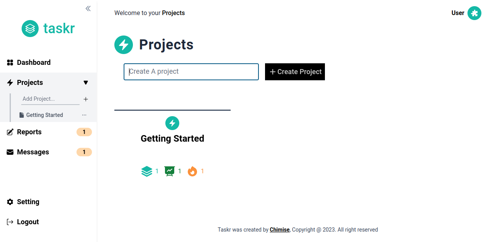

# Project Management App

A fullstack application for creating and managing the lifecycle of your tasks for your projects from the creation to the completion stage.

**Live Demo**: [https://taskr-beryl.vercel.app/](https://taskr-beryl.vercel.app/)

**Screenshot - Dashboard**


**Screenshot - Projects**


**Screenshot - Project-Details**


**Screenshots - Messages**


## Features
- View statistics about created projects and state of created tasks.
- Create new project and tasks, update or delete them and track the lifecycle of tasks for a project.
- Add comments to created tasks, mark them as favourites or like them.
- Show new reports or messages and view them only once.
- Caching and deduping of API request to the backend resulting in a better performance
- Optimistic UI updates leading to a better user experience.
- Prevent loss of data when creating or updating task which can occur by reloading the page or going to new pages by showing confirmation popups.
- Secure authentication with JWT Token and authorization.
- Update user information like name and password.

## Technologies Used
This Project is built with:
* [Next.js](https://nextjs.org/)
* [Postgres](https://www.postgresql.org/)
* [Tailwind CSS](https://tailwindcss.com/)
* [Framer Motion](https://www.framer.com/)
* [Knex](https://knexjs.org/)
* [TypeScript](https://www.typescriptlang.org/)

## Usage
To run the project locally, follow these steps below:
* Install postgres database on your computer [if not already installed](https://www.postgresql.org/download/) and create a new user and database.
* Install [Node.js](https://nodejs.org/en/download/) if not already installed and run the command ```npm install -g knex``` on your terminal to install knex globally.
* Clone this repository, create an .env.local file in the root folder and add the following enviromental variables **DB_USER**, **DB_NAME**, **DB_PASSWORD** and **JWT_SECRET**.
* Run the following command ```knex migrate:latest --knexfile ./utils/knexfile.js``` and ```knex seed:run --knexfile ./utils/knexfile.js``` to run the all the migrations and seeds.
* Install the dependencies by running ```npm install``` and run the command ```npm run dev``` to start up your development server.
* Visit [http://localhost:3000](http://localhost:3000) to view the homepage of the web application.
* You can also run all the test files by running ```npm test```.

